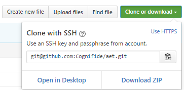

# Automated Exploratory Testing Workshop
<p align="center">
  <a href="https://github.com/Cognifide/aet" target="_blank">
    
  </a>
</p>

## AET setup

### 1. Please make sure that you have following software on your local machine (versions are very important):
   * [VirtualBox 5.0.26](https://www.virtualbox.org/wiki/Download_Old_Builds_5_0)
   * [Vagrant 1.8.4](https://www.vagrantup.com/downloads.html)
   * [ChefDK 0.17.17](https://downloads.chef.io/chef-dk/)
   * [Maven](https://maven.apache.org/download.cgi) (at least version 3.0.4)
   * [JDK 7 or 8](http://www.oracle.com/technetwork/java/javase/downloads/jdk7-downloads-1880260.html)
   * [Chrome browser](https://www.google.com/chrome/browser/desktop/)

TODO - how to check?

### 2. Download AET Vagrant
Please navigate to [AET GitHub Repository](https://github.com/Cognifide/aet) and download or clone it using Git.



   * to download repo, simply click `Download ZIP` and unpack to your workspace directory,
   * to clone repository use your favourite Git client with repository address `https://github.com/Cognifide/aet.git` (or `git@github.com:Cognifide/aet.git` if you have GitHub account).

### 3. Start AET Vagrant machine
Please navigate to your local AET repository to `vagrant` directory.
Open command prompt as an administrator and execute the following commands:

   * `vagrant plugin install vagrant-omnibus`
   * `vagrant plugin install vagrant-berkshelf`
   * `vagrant plugin install vagrant-hostmanager`

Run `berks install` and then `vagrant up` to start virtual machine. This process may take a few minutes.

### 4. Check your machine
Enter [http://aet-vagrant:8181/system/console](http://aet-vagrant:8181/system/console) to check setup status after vagrant finished AET setup.

Console credentials are: 

   * username `karaf`, 
   * password `karaf`.

You should see the information `Bundle information: 251 bundles in total - all 251 bundles active`.

#### Running suite

Now you are ready to run your first suite to check if instance is running properly. To do it, create `aet-test` directory.
Inside directory create two files `pom.xml` and `suite.xml` with content defined below:

**pom.xml**
```xml
<?xml version="1.0" encoding="UTF-8"?>
<project xmlns="http://maven.apache.org/POM/4.0.0"
         xmlns:xsi="http://www.w3.org/2001/XMLSchema-instance"
         xsi:schemaLocation="http://maven.apache.org/POM/4.0.0 http://maven.apache.org/xsd/maven-4.0.0.xsd">
  <modelVersion>4.0.0</modelVersion>

  <groupId>com.cognifide.aet.workshop</groupId>
  <artifactId>my-project</artifactId>
  <version>0.1.0</version>
  <packaging>pom</packaging>

  <name>AET :: Test Suite Execution</name>
  <url>https://github.com/Cognifide/aet</url>

  <properties>
    <aet.version>2.0.0</aet.version>
    <project.build.sourceEncoding>UTF-8</project.build.sourceEncoding>
  </properties>

  <build>
    <plugins>
      <plugin>
        <groupId>com.cognifide.aet</groupId>
        <artifactId>aet-maven-plugin</artifactId>
        <version>${aet.version}</version>
      </plugin>
    </plugins>
  </build>

</project>

```

**suite.xml**
```xml
<?xml version="1.0" encoding="UTF-8" ?>
<suite name="check" company="cognifide" project="workshops">
    <test name="my-first-test">
        <collect>
            <open/>
            <wait-for-page-loaded/>
            <resolution width="1200" height="800"/>
            <sleep duration="2000"/>
            <screen name="desktop"/>
        </collect>
        <compare>
            <screen comparator="layout"/>
        </compare>
        <urls>
            <url href="https://www.google.pl/"/>
        </urls>
    </test>
</suite>
```

Run it performing maven command inside `aet-test` directory using command line:

`mvn aet:run`

This action will execute `check` suite. 
You can learn more about running suites in [AET wiki](https://github.com/Cognifide/aet/wiki/RunningSuite).

While running a suite you should see its progress in the console. It looks like this:

```
[INFO] ********************************************************************************
[INFO] ********************** Job Setup finished at 16:13:24.388.**********************
[INFO] *** Suite is now processed by the system, progress will be available below. ****
[INFO] ********************************************************************************
[INFO] [16:13:24.465]: COLLECTED: [success: 0, total: 1] ::: COMPARED: [success: 0, total: 0]
[INFO] [16:13:30.447]: COLLECTED: [success: 1, total: 1] ::: COMPARED: [success: 1, total: 1]
```

After suite processing by AET is finished you should see following information with url to the report:

```
[INFO] Received report message: FinishedSuiteProcessingMessage{correlationId=cognifide-workshops-check-1474577335419, status=OK, errors=[]}
[INFO] Report is available at http://aet-vagrant/report.html?company=cognifide&project=workshops&correlationId=cognifide-workshops-check-1474577335419
[INFO] Suite processing finished.
[INFO] ------------------------------------------------------------------------
[INFO] BUILD SUCCESS
[INFO] ------------------------------------------------------------------------
[INFO] Total time: 8.721s
[INFO] Finished at: Thu Sep 22 16:13:30 CEST 2016
[INFO] Final Memory: 11M/204M
[INFO] ------------------------------------------------------------------------
```

After you navigate to report url: 
`http://aet-vagrant/report.html?company=cognifide&project=workshops&correlationId=cognifide-workshops-check-1474577335419`
you will see the report. Another way to open the report is to open `redirect.html` from `target` directory file that is the result of a Maven build. 
It will redirect browser to report web application. 

If you can see the report with a screenshot captured means you are ready to start your AET adventure.

## Exercises
There are 3 simple exercises that will quickly introduce you to the AET World. 
Order of performing exercises is not important, however we suggest starting with `exercise 1`.
Before running each exercise suite check out `explained` version of suite which contains comments with suite details.

You will find each exercise description inside its directory.

You will also find in this repository `pom-template.xml` and `suite-template.xml` that may be useful in the future to setup your own tests.

Directory `exercise-page` contains sources of a page that is used in the workshop. You may simply run it using [Apache Server](https://httpd.apache.org/download.cgi).