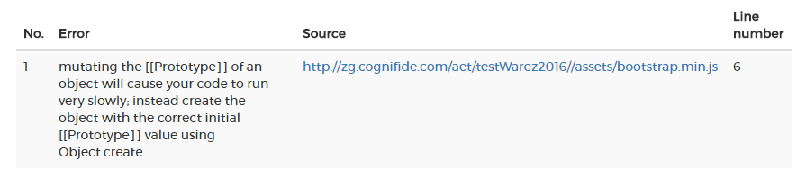

# Automated Exploratory Testing Workshop - Exercise 1

In this exercise you will learn about collecting, comparing and understanding AET report of:

* screenshots,
* js errors,
* source,
* w3c compliance,
* status codes,
* accessibility.

Please see `exercise1-explained.xml` for detailed explanation of suite XML file structure.

## Running suite
In order to run suite on your local Vagrant machine, run following command in this directory:

`mvn aet:run -DtestSuite=exercise1.xml -Ddomain=DOMAIN_WHERE_EXERCISE_PAGE_IS_HOSTED`

This action will execute `exercise1` suite. 
Please remember about changing `DOMAIN_WHERE_EXERCISE_PAGE_IS_HOSTED` to the real domain where the exercise page is hosted.
If you want to run suite now, please use `exercise1-explained.xml` - suite definition in `exercise1.xml` is not ready to perform test before starting exercises.
You can learn more about running suite in [AET wiki](https://github.com/Cognifide/aet/wiki/RunningSuite) and [Workshop description](https://github.com/Skejven/aet-workshop#running-suite).

## Exercise
In this exercise you will be modifying `exercise1.xml` suite to prepare full test of `index.html` page step by step.

#### 1. Screenshot comparison 
Update a test from `exercise1.xml` to obtain a report that will present differences between `index.html` page *screenshots* in 1200x800 resolution.

Perform following steps:
   * add [open](https://github.com/Cognifide/aet/wiki/Open) command at the begginig of the `collect` phase, please **remember that page must be opened before any collection happens**,
   * add [screen collector](https://github.com/Cognifide/aet/wiki/ScreenCollector) to capture page screenshot,
   * before taking screenshot modify view [resolution](https://github.com/Cognifide/aet/wiki/ResolutionModifier) to 1200 x 800 px,
   * it is a good practice to let the page adjust to the new resolution before capturing a screenshot, wait 1000 ms (1 second) using a [sleep modifier](https://github.com/Cognifide/aet/wiki/SleepModifier),
   * add [layout comparator](https://github.com/Cognifide/aet/wiki/LayoutComparator) that will compare all collected screenshots with pattern using `layout` comparator,
   * add [wait-for-page modifier](https://github.com/Cognifide/aet/wiki/WaitForPageLoadedModifier) before capturing screenshot to be sure the page DOM is loaded.

[Run suite](#running-suite) and check your report.

------

#### 2. JS Errors 
Update a test from `exercise1.xml` so that it checks *js errors*.

Perform following steps:
   * add [js-errors collector](https://github.com/Cognifide/aet/wiki/JSErrorsCollector),
   * add [js-error comparator](https://github.com/Cognifide/aet/wiki/JSErrorsComparator) that will check all collected js errors and decide if they are expected or not.
   
[Run suite](#running-suite) and check your report.

You will notice that you have an error in your report: 



Assume that this error is expected because it comes from 3rd party vendor and it does not work on an environment that we are using to test.

Let's fix it. You may filter it using [JS Errors Data Filter](https://github.com/Cognifide/aet/wiki/JSErrorsDataFilter) 
by discarding every error in `bootstrap.min.js` file using `source` parameter (full path including `http://` must be defined - the same value as in `Source` column).

[Run suite](#running-suite) again and check your report.

------

#### 3. Source comparison 
Update a test from `exercise1.xml` so that it checks page *source*.

Perform following steps:
   * add [source collector](https://github.com/Cognifide/aet/wiki/SourceCollector),
   * add [source comparator](https://github.com/Cognifide/aet/wiki/SourceComparator) that will compare page source with pattern.
   
[Run suite](#running-suite) and check your report.

------

#### 4. W3C Compliance 
Update a test from `exercise1.xml` so that it checks page *w3c* compliance.

Perform following steps:
   * you already have [source collector](https://github.com/Cognifide/aet/wiki/SourceCollector) added in [step #3](#3-source-comparison) 
   and there is no need to collect it again since w3c comparator also uses page source to perform check,
   * add [w3c-html5 comparator](https://github.com/Cognifide/aet/wiki/W3CHTML5Comparator) that will check source w3c compliance.
   
[Run suite](#running-suite) and check your report.

You will see that test failed again, because there is missing `alt` attribute in `` tag.

Let's assume again, that we don't want to bother this error any more because it is a known-issue of our CMS and we are aware of it.
It should not break our tests every run. We can filter it out using [W3C Html Issues Filter](https://github.com/Cognifide/aet/wiki/W3CHTML5IssuesFilter).
Try to filter this error by the `line` number that is shown in the report.

[Run suite](#running-suite) again and check your report.

------

#### 5. Status codes 
Update a test from `exercise1.xml` so that it checks page *status codes*.

Perform following steps:
   * add [status-codes collector](https://github.com/Cognifide/aet/wiki/StatusCodesCollector),
   * please notice, that [status-codes collector](https://github.com/Cognifide/aet/wiki/StatusCodesCollector) 
   requires [proxy](https://github.com/Cognifide/aet/wiki/SuiteStructure#proxy) running in `rest` mode, add `useProxy="rest"` property
   to `homepage` test, if you forgot to set the proxy parameter you will see the warning:
   
   ```
   [WARN] [Step: `status-codes` (with parameters: {}) thrown an exception when collecting url: /index.html in: `homepage` test. Cause: Cannot collect status codes without using proxy!]
   ```
   
   * add [status-codes comparator](https://github.com/Cognifide/aet/wiki/StatusCodesComparator) that will check for all status codes within range 400 to 500.
   
[Run suite](#running-suite) and check your report.

Test failed again. There are two `404` status codes (which are within 400 - 500 range) that occurred. 
We know those issues - they occur only in the test environment because of 3rd party libraries. 
Luckily we can ignore them with help of [Status Codes Data Filter](https://github.com/Cognifide/aet/wiki/StatusCodesDataFilters).
Exclude from status codes comparison all assets that have `.css` and `.js` extension. 
In order to do that use `<exclude>` filter with `pattern` attribute and set file extension [regular expression](http://www.regular-expressions.info/).

[Run suite](#running-suite) and check your report.

You will see now, that excluded 404 status codes are in `All gathered status codes` list.

------

#### 6. Accessibility 
Update a test from `exercise1.xml` so that it checks page *accessibility*.

Perform following steps:
   * add [accessibility collector](https://github.com/Cognifide/aet/wiki/AccessibilityCollector) that will gather page accessibility data,
   * add [accessibility comparator](https://github.com/Cognifide/aet/wiki/AccessibilityComparator) that will check page accessibility.
   
[Run suite](#running-suite) and check your report.

As you can see test failed again. Reason is the same issue that w3c comparator found - lack of `alt` attribute in an image.
Since we can't do anything to fix it, lets filter it out from our test's results using [Accessibility Data Filter](https://github.com/Cognifide/aet/wiki/AccessibilityDataFilter).
Use `error` attribute of a filter and paste there description of an error (bolded text form the report): `Img element missing an alt attribute. Use the alt attribute to specify a short text alternative.`.

[Run suite](#running-suite) and check your report.